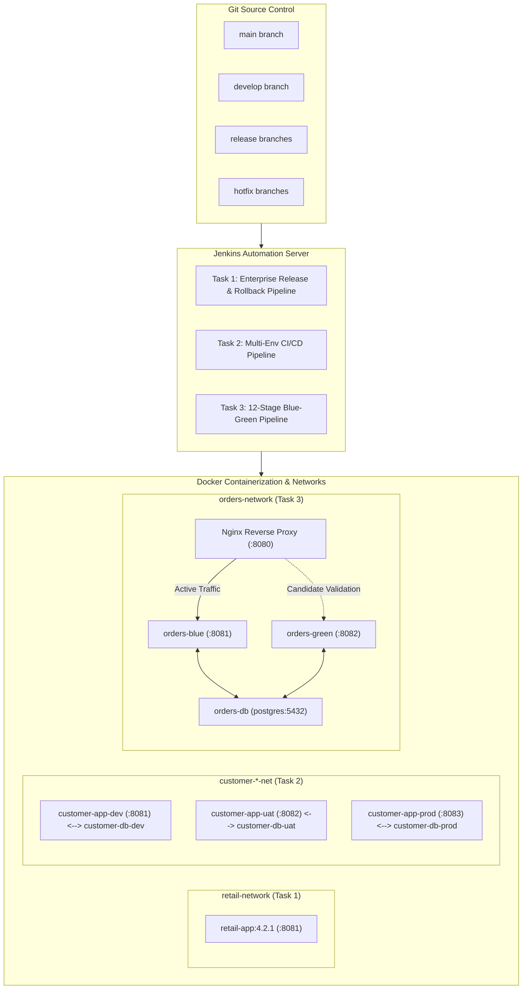

# Comprehensive DevOps Assessment Architecture & Implementation Overview

## 1. End-to-End System Architecture

---

## 2. Technical Explanation of Complete Git -> Jenkins -> Docker Flow

### 1. Git Branching Strategy & Traceability
- **Semantic Tagging & Immutability:** Every deployment is traceable to a specific Git commit SHA and an immutable semantic version tag (e.g. `v4.2.1`, `v5.0.0`, `v7.9.0`). Images are never tagged with `latest` alone in production to ensure deterministic builds.
- **GitFlow / Trunk-Based Hybrid:**
  - `main`: Reflects production-ready code.
  - `develop`: Aggregates active feature branches.
  - `release/*`: Stabilizes release candidates for UAT before promoting to `main`.
  - `hotfix/*`: Branches directly off `main` for critical emergencies, merged into both `main` (tagged) and `develop` to prevent regression.

### 2. Jenkins Automated Pipeline Governance
- **Production Confirmation Barrier:** All production stages enforce `CONFIRM_PROD == 'YES'` to prevent unintended or unauthorized deployments.
- **Pre-Flight Validation:** Pipelines validate version tags, run regression unit test suites, and print resolved environment configuration matrices before touching containers.
- **Automated Health-Check Gating & Rollback:**
  - New candidate versions are started on dedicated ports/networks alongside existing production versions.
  - The pipeline polls HTTP `/health` endpoints and database connectivity routes up to defined retry limits.
  - **On Success:** Traffic is safely switched, and old instances are decommissioned.
  - **On Failure:** The candidate is immediately terminated, existing traffic remains uninterrupted or safely rolled back, and the Jenkins build is flagged as `FAILURE`.

### 3. Docker Isolation, Networking, and Security
- **Security Posture:** All application containers run as an unprivileged non-root user (`USER node` / UID 1000) to minimize host vulnerability risks.
- **Isolated Bridge Networks:** Separate networks (`retail-network`, `customer-dev-net`, `orders-network`) prevent cross-environment pollution and enable container DNS discovery by service name rather than hardcoded IP addresses or `localhost`.
- **Persistent Named Volumes:** Databases use Docker named volumes (`customer-db-*-data`, `orders-db-data`) to guarantee that container restarts and upgrades never destroy persisted enterprise data.
- **Zero-Downtime Traffic Routing:** Nginx reverse proxy architecture manages dynamic upstream shifts with sub-second hot reloads (`nginx -s reload`), ensuring zero dropped packets during candidate promotion.

